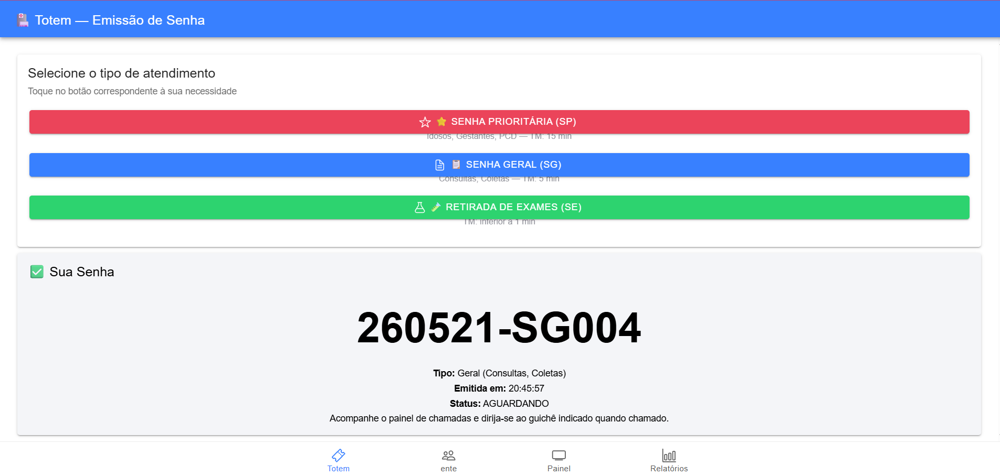
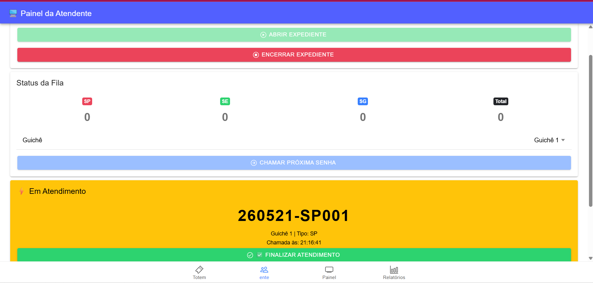
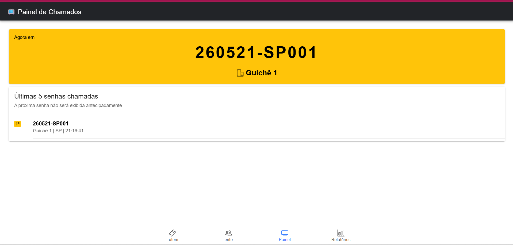

# 🏥 MobileTicketsIonic

> Sistema de controle de atendimento em filas de laboratórios médicos, desenvolvido com **Ionic Angular + Capacitor**.

[](LICENSE)
[](https://ionicframework.com/)
[](https://angular.io/)
[](https://capacitorjs.com/)

---

## Sobre o Projeto

O **MobileTicketsIonic** é um aplicativo móvel e web para gerenciamento de filas em laboratórios médicos. O sistema permite a emissão de senhas por clientes (via totem), o controle de chamadas pela atendente e a exibição de um painel público com as últimas chamadas, além de relatórios diários e mensais.

Projeto acadêmico desenvolvido para a disciplina de **Desenvolvimento Mobile** — **UNINASSAU**, baseado no documento de requisitos *Controle de Atendimento*.

---

## 🖥️ Telas do Sistema

### Totem de Emissão de Senhas
> O cliente escolhe o tipo de atendimento e recebe sua senha no formato `YYMMDD-PPSQ`.



---

### Painel da Atendente
> A atendente abre o expediente, chama a próxima senha respeitando a ordem de prioridade e finaliza os atendimentos.



---

### Painel Público de Chamados
> Exibe a senha em atendimento atual e as últimas 5 senhas chamadas. A próxima senha **não** é exibida antecipadamente.



---

### Relatórios
> Relatórios diários com quantitativos por tipo, TM de atendimento e detalhamento completo por senha.


---

## Agentes do Sistema

| Agente           | Sigla | Papel                                                     |
| ---------------- | ----- | --------------------------------------------------------- |
| Agente Sistema   | AS    | Emite senhas e responde aos comandos                      |
| Agente Atendente | AA    | Chama o próximo, realiza o atendimento no guichê          |
| Agente Cliente   | AC    | Emite a senha no totem e aguarda ser chamado no painel    |

---

## Tipos de Senha

| Tipo   | Descrição                                      | Tempo Médio (TM)          |
| ------ | ---------------------------------------------- | ------------------------- |
| **SP** | Senha Prioritária (Idosos, Gestantes, PCD)     | 15 min ± 5 min aleatório  |
| **SG** | Senha Geral (Consultas, Coletas)               | 5 min ± 3 min aleatório   |
| **SE** | Retirada de Exames                             | 1 min (95%) ou 5 min (5%) |

---

## Regras de Negócio

### Ordem de Prioridade

```
[SP] → [SE|SG] → [SP] → [SE|SG] → ...
```

- **SP** tem prioridade máxima — sempre chamada antes das demais
- Após uma SP, chama-se SE (se houver), senão SG
- **SG** possui menor prioridade
- Nenhum guichê é exclusivo para um tipo de senha

### Formato da Numeração

```
YYMMDD-PPSQ
```

- `YY` = ano com 2 dígitos
- `MM` = mês com 2 dígitos
- `DD` = dia com 2 dígitos
- `PP` = tipo da senha (SP, SE, SG)
- `SQ` = sequência por prioridade, com reinício diário

### Expediente

- **Início:** 07:00
- **Fim:** 17:00
- Senhas não atendidas ao fim do expediente são descartadas

### Desistência do Cliente

- **5%** das senhas emitidas são descartadas automaticamente (responsabilidade do AC), sem que o SA seja executado

---

## 📊 Relatórios

- Quantitativo geral de senhas emitidas e atendidas
- Quantitativo por prioridade (SP / SE / SG)
- Detalhamento: numeração, tipo, data/hora de emissão, data/hora de atendimento, guichê, status
- Tempo Médio de Atendimento (TM) por tipo — variação aleatória aplicada

---

## Como Executar

### Pré-requisitos

- Node.js >= 18
- npm >= 9
- Ionic CLI: `npm install -g @ionic/cli`
- Angular CLI: `npm install -g @angular/cli`

### Instalação

```bash
# Clone o repositório
git clone https://github.com/SEU_USUARIO/MobileTicketsIonic.git
cd MobileTicketsIonic

# Instale as dependências
npm install

# Execute no navegador
ionic serve
```

### Build para produção

```bash
ionic build --prod
```

### Executar no Android (via Capacitor)

```bash
ionic build
npx cap add android
npx cap sync
npx cap open android
```

### Executar no iOS (via Capacitor)

```bash
ionic build
npx cap add ios
npx cap sync
npx cap open ios
```

---

## Estrutura do Projeto

```
MobileTicketsIonic/
├── src/
│   ├── app/
│   │   ├── models/
│   │   │   ├── ticket.model.ts          # Interface Ticket, enums TicketType e TicketStatus
│   │   │   └── queue.model.ts           # Interface QueueState
│   │   ├── services/
│   │   │   └── queue.service.ts         # Toda a lógica de negócio da fila
│   │   ├── pages/
│   │   │   ├── totem/                   # Tela do cliente (emissão de senha)
│   │   │   ├── attendant/               # Tela da atendente (chamada e gestão)
│   │   │   ├── panel/                   # Painel público de chamados
│   │   │   └── reports/                 # Relatórios diários
│   │   ├── tabs/                        # Navegação por abas
│   │   ├── app.module.ts                # Módulo raiz (ngModules)
│   │   ├── app-routing.module.ts
│   │   └── app.component.ts
│   ├── theme/
│   │   └── variables.scss
│   ├── global.scss
│   ├── main.ts
│   └── index.html
├── capacitor.config.ts
├── ionic.config.json
├── angular.json
├── tsconfig.json
├── .gitignore
├── LICENSE
└── README.md
```

---

## Tecnologias Utilizadas

- [Ionic Framework 7](https://ionicframework.com/)
- [Angular 17](https://angular.io/) com **ngModules**
- [Capacitor 5](https://capacitorjs.com/)
- [TypeScript 5](https://www.typescriptlang.org/)
- [RxJS 7](https://rxjs.dev/)

---

## Licença

Este projeto está licenciado sob a **MIT License** — veja o arquivo [LICENSE](LICENSE) para detalhes.

---

## Contexto Acadêmico

Projeto desenvolvido como atividade prática da disciplina de **Desenvolvimento Mobile**, no curso de **Análise e Desenvolvimento de Sistemas** — **UNINASSAU**.
